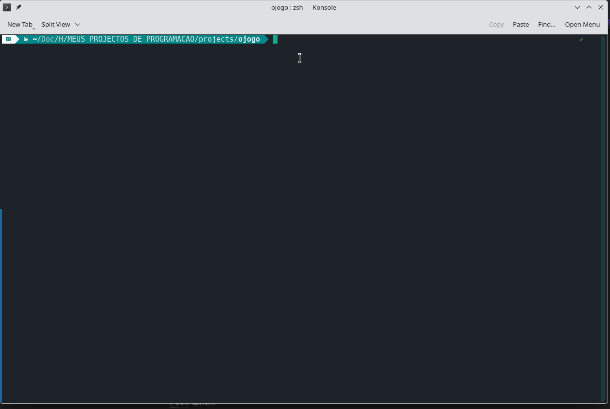
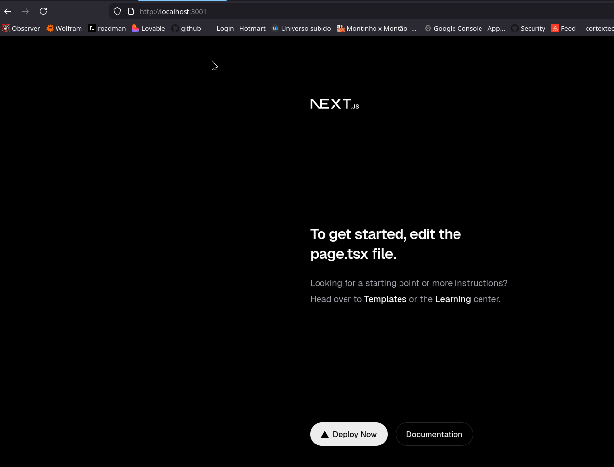
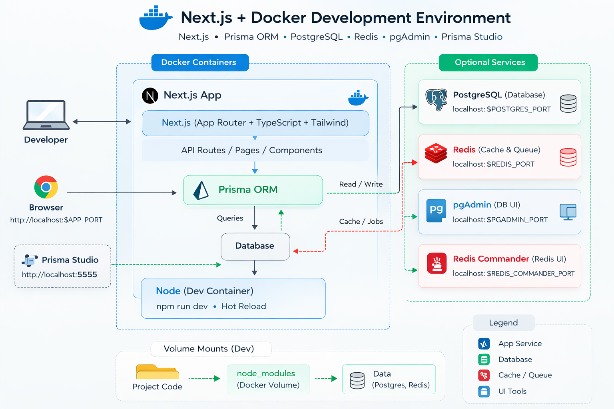

# Next.js Docker Development Template


Create a **complete full‑stack development environment for Next.js in minutes**.

This repository is a **GitHub template (blueprint)** used to generate new projects with a fully configured Docker development stack.

---

# Demo

> A Quickstart demo GIF.

| Demo 1 | Demo 2 | Demo 3 |
| :---: | :---: | :---: |
|  |  |  |
| Demo 4 | Demo 5 | Demo 6 |
|  |  |  |
| Demo 7 | Demo 8 |
|  |  |

---

# Why This Template Exists

Setting up a modern full‑stack development environment usually requires configuring:

* Node
* Next.js
* Docker
* PostgreSQL
* Redis
* Prisma ORM
* environment variables
* development scripts

This template automates the entire process.

Running a single setup script generates a **fully working development environment** so you can start building immediately.

---

# Architecture

> Recommended: add a diagram in `/docs/architecture.png` or `/docs/architecture.svg`



Typical stack generated by this template:

```
Browser
   │
   ▼
Next.js (Docker container)
   │
   ▼
Prisma ORM
   │
   ▼
PostgreSQL

Optional services
 ├ Redis
 ├ pgAdmin
 ├ Redis Commander
 └ Prisma Studio
```

All services communicate through Docker networking.

---

# What This Template Generates

Each generated project includes:

* Next.js application
* Docker development environment
* Prisma ORM
* Prisma Studio
* PostgreSQL database (optional)
* Redis cache (optional)
* pgAdmin database UI (optional)
* Redis Commander UI (optional)

Everything runs in **isolated Docker containers**, keeping your system clean.

---

# Quick Start

## 1 — Create a project from this template

Click the **Use this template** button on GitHub.

Then create your new repository.

---

## 2 — Clone your project

```bash
git clone https://github.com/YOUR-USERNAME/YOUR-PROJECT
cd YOUR-PROJECT
```

Make scripts executable:

```bash
chmod +x setup.sh dev.sh
```

---

## 3 — Run project setup

```bash
./setup.sh
```

The setup script will automatically:

* generate a Next.js project
* install Prisma ORM
* configure Docker
* generate environment variables
* configure optional services

---

## 4 — Start development

```bash
./dev.sh rebuild
```

This builds containers and launches the development environment.

---

# View Service URLs

To see the correct URLs for all services:

```bash
./dev.sh ports
```

Example output:

```
Next.js → http://localhost:3001
Prisma Studio → http://localhost:5555
pgAdmin → http://localhost:5050
Redis Commander → http://localhost:8082
```

Ports may automatically change if the default ports are already in use.

---

# Development Commands

Start containers

```
./dev.sh start
```

Stop containers

```
./dev.sh stop
```

Rebuild environment

```
./dev.sh rebuild
```

View logs

```
./dev.sh logs
```

Show container status

```
./dev.sh status
```

Show service ports

```
./dev.sh ports
```

Check environment health

```
./dev.sh doctor
```

Reset Docker environment

```
./dev.sh reset
```

---

# Folder Structure

Typical generated project structure:

```
project-root
│
├── app
├── src
├── prisma
│   └── schema.prisma
│
├── .docker
│   ├── dev
│   │   ├── Dockerfile
│   │   └── docker-compose.yml
│   │
│   └── data
│       ├── postgres
│       ├── redis
│       └── pgadmin
│
├── setup.sh
├── dev.sh
├── .env
└── README.project.md
```

---

# Prisma ORM Example

Example Prisma model:

```
model User {
  id    Int     @id @default(autoincrement())
  email String  @unique
  name  String?
}
```

Run migrations:

```
./dev.sh migrate
```

Generate Prisma client:

```
./dev.sh generate
```

Open Prisma Studio:

```
./dev.sh studio
```

Then visit:

```
http://localhost:5555
```

---

# Optional Services

You may enable or disable these during setup:

* PostgreSQL
* Redis
* pgAdmin
* Redis Commander

---

# License

MIT License